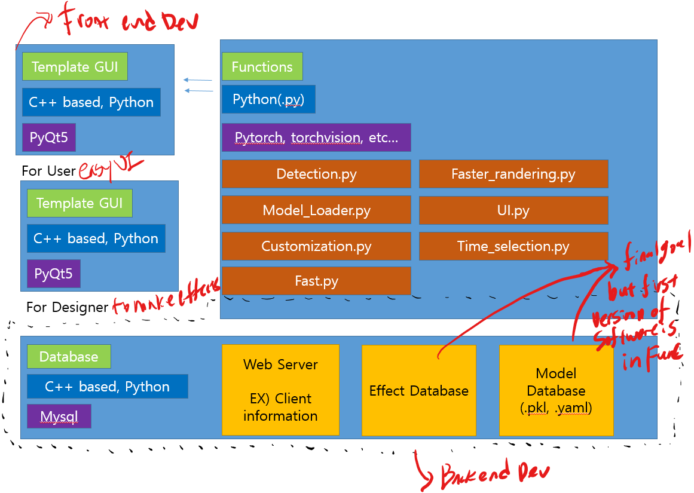

## What is the problem?
Originally doodle effects need tremendous work for designer to draw.
Many software such as Adobe After Effect. Still this software suggest
half automatic(tracking) UI.
We will offer fully automatic software, also maintaining the idea of design.

#### Architecture Picture

    

#### GUI/UI Expectation Picture

References
* [How to make webapp architecture](https://cs.lmu.edu/~ray/notes/webapps/)

* [Useful diagram for understanding Python based architecture flow](https://www.researchgate.net/figure/ODM-Tools-Python-software-architecture_fig2_275673185)

* [What is the differences between Back and Front Developer](https://moolgogiheart.tistory.com/16)

* [Related Video(GUI, Python, OpenCV collaboration)](https://www.youtube.com/watch?v=6RCDWMEitDI)

* [Automatic resize problem in PyQt5](https://www.youtube.com/watch?v=Y-8N1dPFsVE)

##### Template GUI
* Video loading window
* Effect changing window
* Effect selecting window
* Video time selection window
* Video current play bar window
* Save/Change/Delete bar window

Common References
* [Problem of automatic resizes in GUI](https://www.youtube.com/watch?v=FOIbK4bJKS8)

Look at the time of 32:42, and this video is basic information about making in C++ which
is not compatible for our project. However it is useful information to look for it.

##### Functions
* Detection processing file
* Effect implementation file

##### Database (Future Work)

## GUI Language
[PtQy5](https://build-system.fman.io/pyqt5-tutorial)

References
* [Tutorial](http://codetorial.net/pyqt5/basics/icon.html)
* [What is pyqt](https://steemit.com/kr/@papasmf1/python-pyqt-gui-graphical-user-interface)

## Algorithm Language
Python, C++(Expected)

## Web Language
Django(if it is needed)
